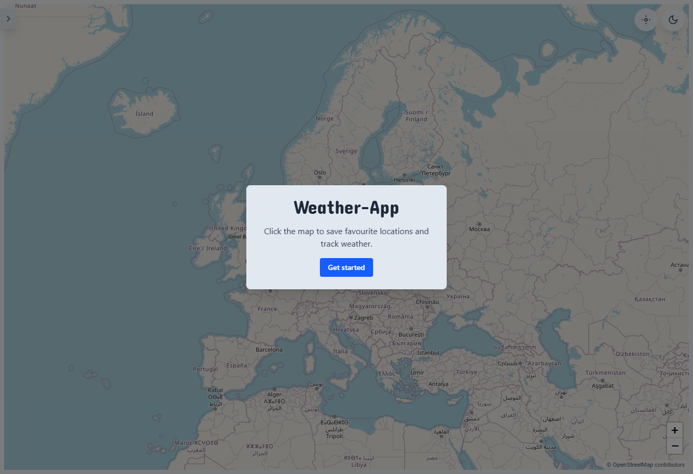
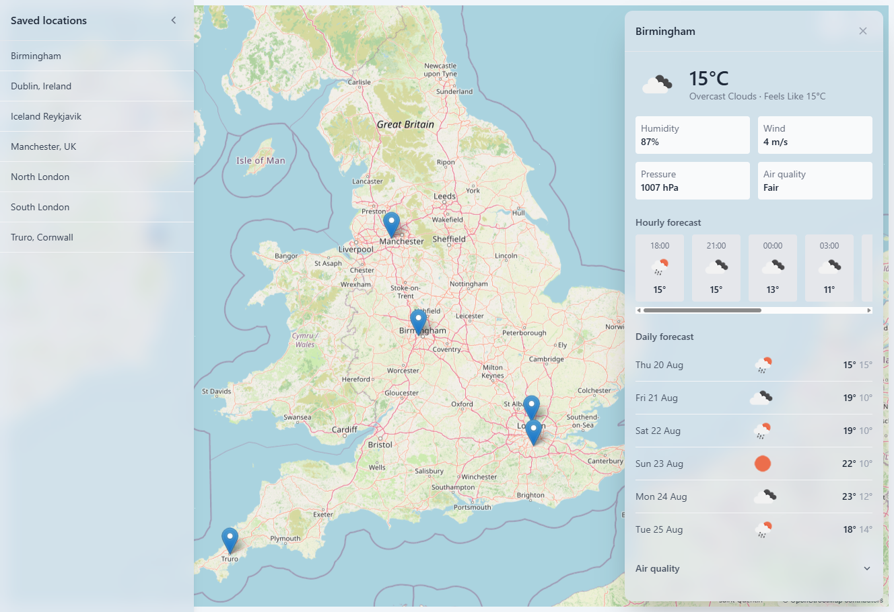
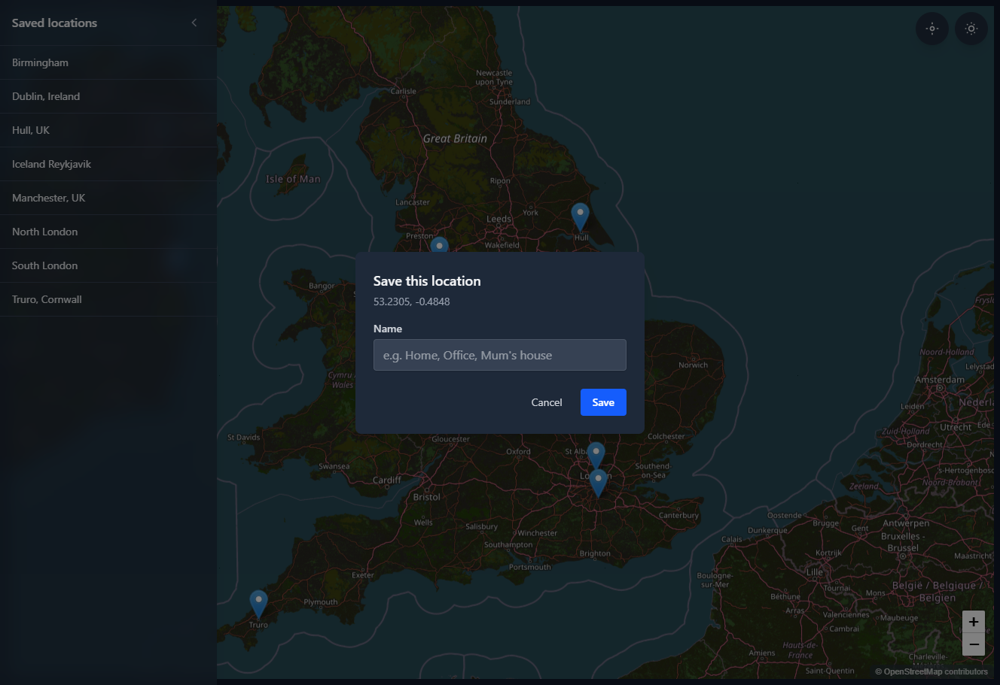
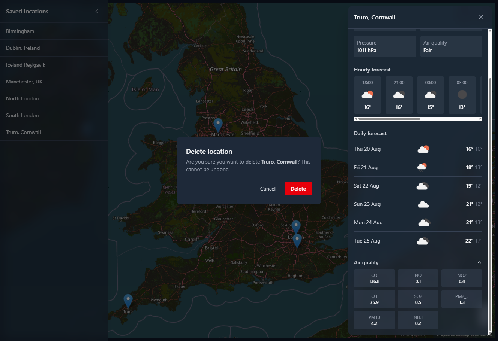

# Weather Map Application

## Overview

The Weather Map Application is a Laravel + Livewire project that provides an interactive world map where users can save favourite locations and view detailed weather information.

It uses LeafletJS for mapping and OpenWeatherMap for current weather, forecast, and air quality data.

This project is a technical test submission demonstrating clean architecture, modern Laravel tooling, Livewire components, Tailwind styling, and third-party API integration.

## Screenshots

|                                                           | |
|-----------------------------------------------------------|---|
|    |  |
| Welcome overlay (light mode)                           | Weather panel with live data (light mode) |
|  |  |
| Save-location modal (dark mode)                           | Delete confirmation, with air quality expanded (dark mode) |

## Features

- Full-screen interactive map (LeafletJS + OpenStreetMap tiles)
- Click-to-save locations (via map click or the "use my location" button), with a name and coordinates persisted to SQLite
- Duplicate-location prevention (unique DB constraint + a friendly validation message, not a raw error)
- Collapsible sidebar listing saved locations — fully clickable rows with a hover highlight, a tooltip for truncated names, and a styled delete-confirmation modal (not the browser's native `confirm()`) with a toast confirmation after deleting
- Clicking a map marker opens the weather panel, the same as clicking a location in the sidebar
- Slide-in weather panel: current weather, hourly forecast, daily forecast, and a collapsible air quality section (collapsed by default); each section degrades independently if its API call fails, rather than the whole panel failing
- Light/dark theme toggle (persisted in localStorage), including a dark map tile filter
- Onboarding overlay shown whenever there are no saved locations (on load, and again if the last one is deleted); the sidebar auto-collapses while it's showing and reopens once dismissed
- Subtle, compliant OpenStreetMap attribution
- Typed data-transfer objects for weather/forecast/air-quality data
- 10-minute response caching, automatic HTTP retry on transient failures, and per-session rate limiting on weather fetches
- Pest test suite (unit, feature, and Livewire component tests)
- PHPStan (level 8) + Laravel Pint for code quality

## Tech Stack

- Laravel 13
- Livewire v4
- TailwindCSS v4
- LeafletJS (via CDN)
- SQLite
- Pest
- PHPStan / Larastan
- Laravel Pint
- Laravel Boost (best practices, Livewire, Tailwind, and Pest skills)

## Installation

### 1. Clone the repository

```
git clone <your-repo-url>
cd weather-app
```

### 2. Install PHP dependencies

```
composer install
```

### 3. Install JS dependencies and build assets

```
npm install
npm run build
```

(Use `npm run dev` instead if you want hot-reloading while working on the frontend.)

### 4. Environment setup

```
cp .env.example .env
php artisan key:generate
```

`.env.example` already includes a working, free-tier OpenWeatherMap API key so the app runs out of the box:

```
DB_CONNECTION=sqlite
OPENWEATHER_API_KEY=020ccc09ecda0abbc8e5bb42a69663b2
```

Create the SQLite database file:

```
touch database/database.sqlite
```

> To browse the database while the app is running, copy the file first (`cp database/database.sqlite database/database-copy.sqlite`) and open the copy in a database viewer — SQLite locks the active file while Laravel is running.

### 5. Run migrations

```
php artisan migrate
```

### 6. Start the development server

```
php artisan serve
```

Visit `http://127.0.0.1:8000` and click anywhere on the map to save your first location.

## API Key Handling

This project uses a free OpenWeatherMap API key: `020ccc09ecda0abbc8e5bb42a69663b2`. It's committed intentionally, in both `.env` and `.env.example`, so reviewers don't need to sign up for one just to run the app — see step 4 of Installation above.

You may replace it with your own key by editing `OPENWEATHER_API_KEY` in `.env`. All OpenWeatherMap configuration (base URL, units, cache TTL, retry behaviour) lives in `config/weather.php`.

For a production deployment, environment-specific secret management should be used instead of a committed key.

## Architecture Overview

The map page is served by `MapController` (`app/Http/Controllers/`), which just checks whether any locations exist (to decide the onboarding overlay's initial state) and hands off to four Livewire components (`app/Livewire/`):

- **MapInteraction** — initialises the Leaflet map, handles map clicks, marker clicks, and the "use my location" button, switches tile filtering for dark mode, and centers the map on request.
- **LocationList** — the collapsible sidebar; lists, chooses, and deletes saved locations.
- **AddLocationModal** — the modal shown after a map click, for naming and saving a new location. Rejects duplicates (same coordinates) with a friendly validation error backed by a unique DB constraint.
- **WeatherPanel** — the slide-in panel; fetches and displays weather, forecast, and air quality for the chosen location.

These communicate via Livewire's browser event dispatch/listen system (`locationSelected`, `locationSaved`, `locationDeleted`, `locationChosen`, `centerMapOnLocation`), with Leaflet-specific JS wired into `MapInteraction`'s view via Livewire's `@script` directive (required for `$wire` to be available inside a component's own `<script>` block).

Weather data is fetched via three service classes (`app/Services/`), each responsible for one OpenWeatherMap endpoint:

- **WeatherService** — `/data/2.5/weather` (current conditions)
- **ForecastService** — `/data/2.5/forecast` (3-hourly forecast, bucketed into an hourly window and daily min/max summaries)
- **AirQualityService** — `/data/2.5/air_pollution` (AQI + pollutant components)

Each service caches the *raw API response* (not the constructed object — see note below) for 10 minutes via the `Cache` facade, and retries failed requests automatically (`Http::retry`, configurable in `config/weather.php`). Responses are mapped into typed, readonly data-transfer objects (`app/DataTransferObjects/`) so Livewire components and Blade views work with typed properties rather than raw arrays.

> Caching is deliberately applied to the raw array response rather than the constructed DTO. PHP's readonly value objects (which hold `Carbon` instances) don't round-trip reliably through PHP's native object serialization used by file/database cache drivers — caching plain arrays and reconstructing the DTO on every read sidesteps that entirely.

### Resilience

`WeatherPanel::open()` fetches all three endpoints independently — each is wrapped in its own try/catch, so a failure in one (e.g. the forecast endpoint being down) doesn't prevent the other two from loading; the panel only shows a full error state if all three fail. Weather fetches are also rate-limited per session (30/minute) to protect the API key from being burned through accidental or abusive rapid clicking.

## Testing

This project uses Pest for testing.

Test coverage includes:

- **Unit tests** (`tests/Unit/Services/`) — each service class, using `Http::fake()`, including a caching assertion (repeated calls to the same coordinates only hit the API once)
- **Feature tests** (`tests/Feature/`) — the map page renders with all four Livewire components present
- **Livewire component tests** (`tests/Feature/Livewire/`) — sidebar list/choose/delete behaviour, duplicate-location rejection, modal validation and save behaviour, and weather panel loading/error/partial-failure/rate-limit states

Run tests:

```
php artisan test
```

## Development Tooling

### PHPStan

Static analysis at level 8.

```
vendor/bin/phpstan analyse
```

### Pint

Code style enforcement (Laravel preset).

```
vendor/bin/pint
```

## Future Enhancements

- User accounts + per-user locations
- Google Maps integration
- Push/email notifications for severe weather
- Background jobs for periodic weather refresh
- Historical weather
- Drag-and-drop map markers
- Address/place search box to fly the map to a typed location

## Project Structure (High-Level)

```
app/
  DataTransferObjects/
  Http/Controllers/
  Livewire/
  Models/
  Services/

resources/
  views/
    livewire/
    layouts/
    map.blade.php

database/
  migrations/
  factories/
  database.sqlite

routes/
  web.php

config/
  weather.php

PLAN.md
README.md
```
